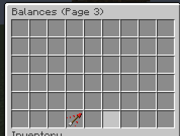
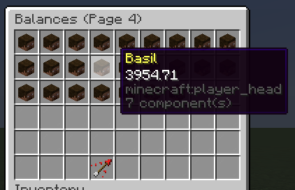

# Vanilla GUI Guide
This guide will take you from a beginner to an expert in vanilla GUIs. Keep in mind that this guide assumes that you know basic Skript.\
Please try to actually understand what is going on rather than copy pasting code if you want to learn. If something is unclear don't hesitate to ask.\
If you have any questions about this guide or would like to request changes create a PR or contact erenkarakal on discord.

# Contents
- [Vanilla GUI Guide](#vanilla-gui-guide)
- [Contents](#contents)
  - [Creating Your First GUI](#creating-your-first-gui)
  - [Creating Interactive GUIs](#creating-interactive-guis)
  - [Animated GUIs](#animated-guis)
  - [Paginated GUIs](#paginated-guis)
  - [The End](#the-end)

## Creating Your First GUI
To create a GUI we will use the custom inventory expression.\
`set {_gui} to a new inventory with 3 rows named "&cMy First GUI"`

Then we are gonna place a stone in the first slot of the GUI. Inventory slots are 0 indexed so slot 1 is actually the second item.\
`set slot 0 of {_gui} to stone named "&eHello World!"`

and to actually see the GUI, we need to open it to the player.\
`open {_gui} to player`

You should have a GUI that looks like this:\


## Creating Interactive GUIs
Now that our "hello world" works we can start creating actual GUIs where the items we click do stuff.\
Lets create a simple gamemode GUI that will let us change our gamemode.
Unlike the last example, we will store our GUIs in RAM variables which will help us check the clicked inventory in inventory events and move our code to a function to keep it nice and clean.\
Using our previous knowledge we can create a non-interactive GUI we can start with.
```d
command /gm-gui:
    executable by: players
    trigger:
        openGamemodeGUI(player)

function openGamemodeGUI(p: player):
    set {-gamemode.gui::%{_p}'s uuid%} to a new chest inventory with 1 row named "Gamemode"
    set slot 0 of {-gamemode.gui::%{_p}'s uuid%} to iron pickaxe named "&eSurvival"
    set slot 1 of {-gamemode.gui::%{_p}'s uuid%} to grass block named "&eCreative"
    set slot 2 of {-gamemode.gui::%{_p}'s uuid%} to iron sword named "&eAdventure"
    set slot 3 of {-gamemode.gui::%{_p}'s uuid%} to ender eye named "&eSpectator"
    open {-gamemode.gui::%{_p}'s uuid%} to {_p}
```
Using this code, you will notice a few minor problems.

First, Skript will warn us that the contents of `{-gamemode.gui::%{_p}'s uuid%}` will be deleted on server restart. We are already aware of this and we don't want to store them after a restart so we can safely suppress this warning.
```d
function openGamemodeGUI(p: player):
    locally suppress variable save warnings
    ...
```

Second, you'll notice that nothing happens when we click the items, so lets add functionality to them.
We will start by using the inventory click event and then check if the clicked inventory was our GUI.
```d
on inventory click:
    event-inventory is {-gamemode.gui::%player's uuid%}
    cancel event         # to not let the player get the item
    close player's inventory         # to close the GUI after clicking
```
with this code you shouldn't be able to take items from the gamemode GUI. Now we will check which item the player clicked on and set their gamemode accordingly.
we could check `if event-item is iron pickaxe ...` but a better of way of doing it would be checking the `index of event-slot` which gives us the slot ID.
```d
on inventory click:
    event-inventory is {-gamemode.gui::%player's uuid%}
    cancel event
    close player's inventory

    if index of event-slot is 0: # survival
        set player's gamemode to survival

    else if index of event-slot is 1: # creative
        set player's gamemode to creative

    else if index of event-slot is 2: # adventure
        set player's gamemode to adventure

    else if index of event-slot is 3: # spectator
        set player's gamemode to spectator
```
Now, we have a working gamemode GUI but there are still some problems with it. You can drag your cursor to place items in the GUI and whenever the inventory is closed it is stored in memory even though we don't need it. We can fix these issues by cancelling the inventory drag event and deleting the GUI when its closed.

```d
# instead of cancelling item drag you can also fill all empty slots with a background item
on inventory drag:
    loop event-inventories:     # contains doesn't work due to a bug.
        loop-value is {-gamemode.gui::%player's uuid%}
        cancel event

on inventory close:
    event-inventory is {-gamemode.gui::%player's uuid%}
    delete {-gamemode.gui::%player's uuid%}
```
and now we can enjoy our finished and working gamemode GUI. If there are still bugs in your GUI make sure you are not in creative mode as it is known for causing issues with certain GUI interactions.
<details markdown='1'>
<summary>Full Code</summary>

```d
command /gm-gui:
    executable by: players
    trigger:
        openGamemodeGUI(player)

function openGamemodeGUI(p: player):
    locally suppress variable save warnings
    set {-gamemode.gui::%{_p}'s uuid%} to a new chest inventory with 1 row named "Gamemode"
    set slot 0 of {-gamemode.gui::%{_p}'s uuid%} to iron pickaxe named "&eSurvival"
    set slot 1 of {-gamemode.gui::%{_p}'s uuid%} to grass block named "&eCreative"
    set slot 2 of {-gamemode.gui::%{_p}'s uuid%} to iron sword named "&eAdventure"
    set slot 3 of {-gamemode.gui::%{_p}'s uuid%} to ender eye named "&eSpectator"
    open {-gamemode.gui::%{_p}'s uuid%} to {_p}

on inventory click:
    event-inventory is {-gamemode.gui::%player's uuid%}
    cancel event
    close player's inventory

    if index of event-slot is 0: # survival
        set player's gamemode to survival

    else if index of event-slot is 1: # creative
        set player's gamemode to creative

    else if index of event-slot is 2: # adventure
        set player's gamemode to adventure

    else if index of event-slot is 3: # spectator
        set player's gamemode to spectator

on inventory drag:
    loop event-inventories:
        loop-value is {-gamemode.gui::%player's uuid%}
        cancel event

on inventory close:
    event-inventory is {-gamemode.gui::%player's uuid%}
    delete {-gamemode.gui::%player's uuid%}
```
</details>

## Animated GUIs
Creating animated GUIs is extremely simple, we only need a while loop to check if our GUI is set and then animate it.
```d
function openGui(p: player):
    # normal gui logic

    while {-inventory::%{_p}'s uuid%} is set:
        set slot 0 of {-inventory::%{_p}'s uuid%} to stone
        wait 1 tick
        set slot 0 of {-inventory::%{_p}'s uuid%} to cobblestone
```
We don't need to do anything extra because that loop will stop when the inventory is closed since we are deleting the variable on inventory close.

## Paginated GUIs
Creating paginated GUIs is way easier than it sounds. In this section we will create a paginated GUI that displays all players and how much money they have (money being stored in `{bal::%uuid%}`). We will start by adding a page parameter to our open GUI function.
```d
function openBalGui(p: player, page: num = 1):
```
Next, we will add our page buttons.
```d
function openBalGui(p: player, page: num = 1):
    set {-bal.gui::%{_p}'s uuid%} to a new chest inventory with 6 row named "Balances (Page %{_page}%)"
    set {-bal.gui::%{_p}'s uuid%::page} to {_page}
    if {_page} > 1:
        set slot 48 of {-bal.gui::%{_p}'s uuid%} to (instant health tipped arrow) named "&cPrevious Page"
    if (45 * {_page}) < size of {bal::*}:     # each page will show 45 elements
        set slot 50 of {-bal.gui::%{_p}'s uuid%} to (night vision tipped arrow) named "&aNext Page"

    open {-bal.gui::%{_p}'s uuid%} to {_p}

on inventory click:
    event-inventory is {-bal.gui::%player's uuid%}
    cancel event

    # handle previous page item
    if all:
        index of event-slot = 48 # previous page slot id
        {-bal.gui::%player's uuid%::page} > 1 # we don't want them to go to page 0
    then:
        subtract 1 from {-bal.gui::%player's uuid%::page}
        openBalGui(player, {-bal.gui::%player's uuid%::page})

    # handle next page item
    if all:
        index of event-slot = 50 # next page slot id
        (45 * {-bal.gui::%player's uuid%::page}) < size of {bal::*} # we don't want them to go to an empty page
    then:
        add 1 to {-bal.gui::%player's uuid%::page}
        openBalGui(player, {-bal.gui::%player's uuid%::page})

on inventory close:
    event-inventory is {-bal.gui::%player's uuid%}
    delete {-bal.gui::%player's uuid%::*}
    delete {-bal.gui::%player's uuid%}
```
While the code may look long the logic is actually pretty simple. We made a basic interactive GUI that calls itself whenever we click a page item.\
If the current page is 1, we didn't put a previous page item as it is not needed. If there aren't enough elements to render the next page we don't put a next page item either.\
With this code you should have an empty GUI with working page buttons.\


Next we will fill our GUI with player heads to show players' balances.
```d
function openBalGui(p: player, page: num = 1):
    set {-bal.gui::%{_p}'s uuid%} to a new chest inventory with 6 row named "Balances (Page %{_page}%)"
    set {-bal.gui::%{_p}'s uuid%::page} to {_page}

    # set background item to prevent item dragging
    set slot (0, 53 times) of {-bal.gui::%{_p}'s uuid%} to (light gray stained glass pane named "&f" with all item flags)

    # set player heads
    set {_start} to {_page} * 45 - 44
    set {_end} to {_start} + 44
    set {_uuids::*} to elements from {_start} to {_end} of (indices of {bal::*})
    loop {_uuids::*}:
        set {_player} to loop-value parsed as offline player
        set slot loop-iteration - 1 of {-bal.gui::%{_p}'s uuid%} to (player skull named "&e%{_player} ? loop-value%" with lore "&f%{bal::%loop-value%}%")

    if {_page} > 1:
    ...
```
With this simple math added you will have a working balance GUI.\


<details markdown='1'>
<summary>Full Code</summary>

```d
function openBalGui(p: player, page: num = 1):
    set {-bal.gui::%{_p}'s uuid%} to a new chest inventory with 6 row named "Balances (Page %{_page}%)"
    set {-bal.gui::%{_p}'s uuid%::page} to {_page}

        # set background item to prevent item dragging
    set slot (0, 53 times) of {-bal.gui::%{_p}'s uuid%} to (light gray stained glass pane named "&f" with all item flags)

        # set player heads
    set {_start} to {_page} * 45 - 44
    set {_end} to {_start} + 44
    set {_uuids::*} to elements from {_start} to {_end} of (indices of {bal::*})
    loop {_uuids::*}:
        set {_player} to loop-value parsed as offline player
        set slot loop-iteration - 1 of {-bal.gui::%{_p}'s uuid%} to (player skull named "&e%{_player} ? loop-value%" with lore "&f%{bal::%loop-value%}%")

    if {_page} > 1:
        set slot 48 of {-bal.gui::%{_p}'s uuid%} to (instant health tipped arrow) named "&cPrevious Page"
    if (45 * {_page}) < size of {bal::*}:     # each page will show 45 elements
        set slot 50 of {-bal.gui::%{_p}'s uuid%} to (night vision tipped arrow) named "&aNext Page"

    open {-bal.gui::%{_p}'s uuid%} to {_p}

on inventory click:
    event-inventory is {-bal.gui::%player's uuid%}
    cancel event

    # handle previous page item
    if all:
        index of event-slot = 48 # previous page slot id
        {-bal.gui::%player's uuid%::page} > 1 # we don't want them to go to page 0
    then:
        subtract 1 from {-bal.gui::%player's uuid%::page}
        openBalGui(player, {-bal.gui::%player's uuid%::page})

    # handle next page item
    if all:
        index of event-slot = 50 # next page slot id
        (45 * {-bal.gui::%player's uuid%::page}) < size of {bal::*} # we don't want them to go to an empty page
    then:
        add 1 to {-bal.gui::%player's uuid%::page}
        openBalGui(player, {-bal.gui::%player's uuid%::page})

on inventory close:
    event-inventory is {-bal.gui::%player's uuid%}
    delete {-bal.gui::%player's uuid%::*}
    delete {-bal.gui::%player's uuid%}
```
</details>

## The End
Hope this guide was helpful. I suck at writing guides so if some parts were unclear please let me know.