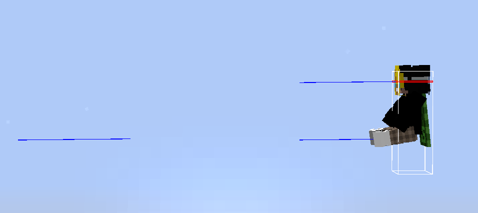
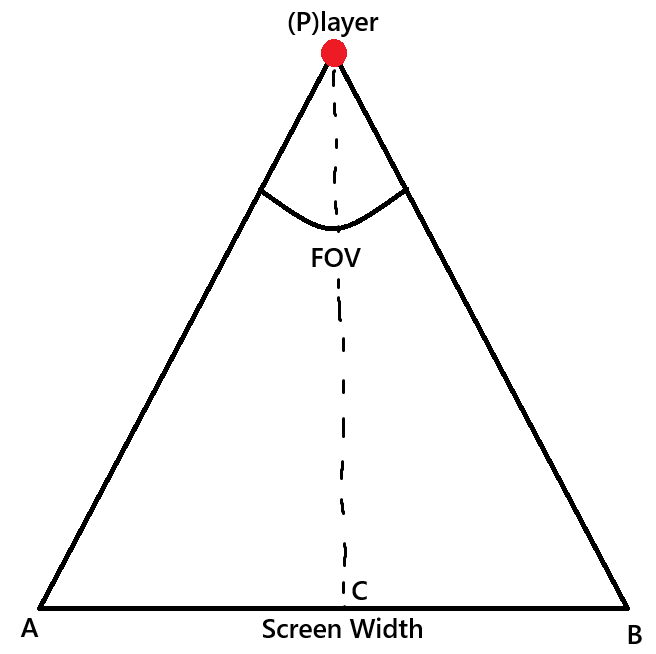
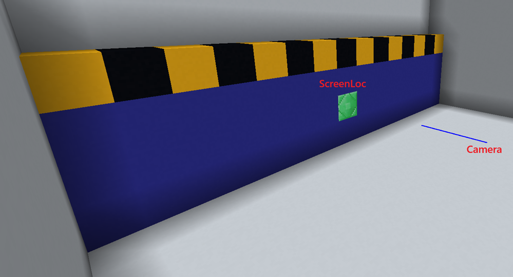
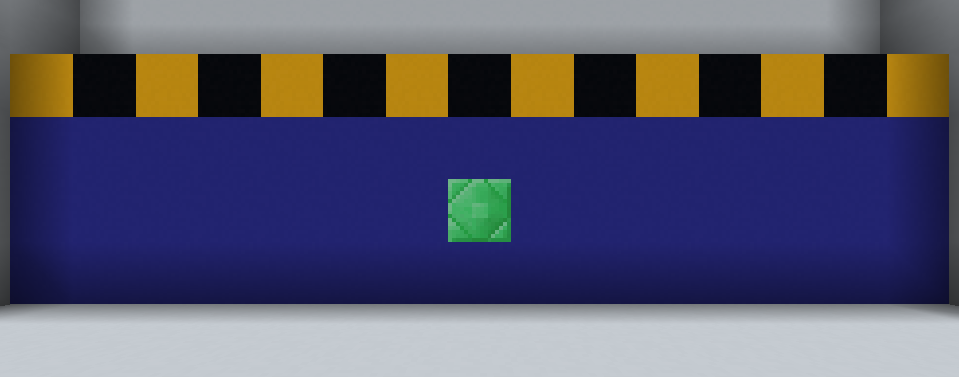
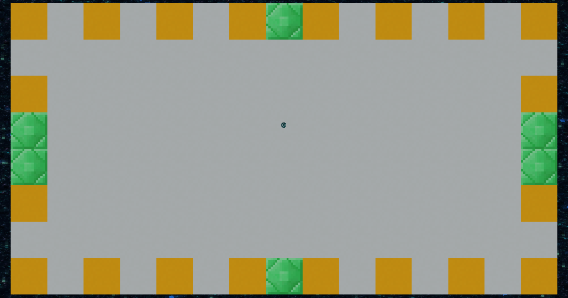

# Creating Screens
This guide will teach you how you can create custom screens.\
It was mainly written for Skript but plugin developers can easily follow along as well.

### Requirements
- Skript
- skript-reflect

# Setting up the camera
We need to do some black magic to keep our camera stable while we move our mouse. We can achieve this by abusing a bug with the camera packet.\
Start by spawning two entities. I'll use text display entities, as they're the smallest in the game.\
One will act as our camera, and the other will be ridden by the player to trigger the glitch. (Don't question it)
> [!IMPORTANT]
> Make sure the distance between the 2 entites are larger than player's reach distance or you might randomly get kicked.

```
function start(p: player, screenLoc: location, camLoc: location):
  spawn text display at {_camLoc}:
    set {_camera} to entity

  spawn text display at ({_camLoc} ~~ vector(0, 0, 5)):
    set {_seat} to entity
    force {_p} to ride {_seat}
```

You should have this with that code:


Next we will send a camera packet to force us to spectate the camera entity (the one on the left).\
You can use the snippet below:
```
import:
  net.minecraft.network.protocol.game.ClientboundSetCameraPacket

function spectate(p: player, target: entity = {_}):
  set {_target} to {_target} ? {_p}
  set {_packet} to new ClientboundSetCameraPacket({_target}.getHandle())
  {_p}.getHandle().connection.sendPacket({_packet})
```

```
function start(p: player, screenLoc: location, camLoc: location):
  spawn text display at {_camLoc}:
    set {_camera} to entity

  spawn text display at ({_camLoc} ~~ vector(0, 0, 5)):
    set {_seat} to entity
    force {_p} to ride {_seat}

  wait 1 tick
  spectate({_p}, {_camera})
```

If you run this code your view should be locked even though your hand is moving around.\
Apply invisibility to the player to hide the hand.

# Calculating camera position
You might've noticed the unused `screenLoc` variable in the code.\
We will use it to calculate how far the camera should be from the screen so that it fits perfectly on our screen.

We need the distance between Player and the C point, which is:\
`PC = AC / tan(FOV / 2)`\
The FOV is not the same as the one you see in settings and either way we don't have a way to get the player's FOV so we will use `105` as the FOV which is the default value.
```
PC = (ScreenWidth / 2) / tan(105 / 2)
PC = (ScreenWidth / 2) / tan(52.5)
PC = (ScreenWidth / 2) / 1.303
PC = ScreenWidth / 2.606
```
```
local function getIdealDistance(screenWidth: num):
  # ({_screenWidth} / 2) / tan(105 / 2)
  return {_screenWidth} / 2.606
```
This formula should work fine as long as `width / height > 1.88`

```
function start(p: player, screenLoc: location):
  set {_distance} to getIdealDistance(15) # 15 = screen width
  set {_camLoc} to {_screenLoc} ~~ vector(0, 0, -1*{_distance})
```
Now our camera location will be calculated automatically to fit our screen.

POV:


<details>
<summary>Full code so far</summary>

```c
import:
  net.minecraft.network.protocol.game.ClientboundSetCameraPacket

function spectate(p: player, target: entity = {_}):
  set {_target} to {_target} ? {_p}
  set {_packet} to new ClientboundSetCameraPacket({_target}.getHandle())
  {_p}.getHandle().connection.sendPacket({_packet})

local function getIdealDistance(screenWidth: num) :: num:
  # ({_screenWidth} / 2) / tan(105 / 2)
  return {_screenWidth} / 2.606

function start(p: player, screenLoc: location):
  set {_screenLoc} to {_screenLoc} ~~ vector(0, 0, 0.6) # because i passed the center of the block
  set {_distance} to getIdealDistance(15) # 15 = screen width
  set {_camLoc} to {_screenLoc} ~~ vector(0, 0, {_distance})
  set yaw of {_camLoc} to 180

  spawn text display at {_camLoc}:
    set {_camera} to entity

  spawn text display at ({_camLoc} ~~ vector(0, 0, 5)):
    set {_seat} to entity
    force {_p} to ride {_seat}

  wait 1 tick
  apply infinite invisibility without particles whilst hiding icon to {_p}
  spectate({_p}, {_camera})
```
</details>


# Adding a cursor
Next we will use the player's pitch and yaw to calculate the cursor location.\
This normally wouldn't be possible without the glitch we triggered in step 1.

We will do a simple normalization by scaling the yaw (between 0 and 360) to a number between 0 and screen width.\
Same with pitch, scale number between -90 and 90 to a number between 0 and screen height.\
I will use 15x8 blocks as my screen size.
```
function start(p: player, screenLoc: location):
  ...

  spawn item display at {_screenLoc}:
    set {_cursor} to entity
    set display scale of {_cursor} to vector(0.15, 0.15, 0.15)
    set interpolation delay of {_cursor} to 0.6 seconds
    set item of {_cursor} to structure void

  # left bottom corner of the screen
  set {_screen.corner} to {_screenLoc} ~~ vector(-7.5, -4, 0)

  set {-cam::%{_p}%} to true
  while {-cam::%{_p}%} is true:
    set {_cursor.x} to ({_p}'s yaw) / 360 * 15 # 15 is the screen width
    set {_pitch} to (({_p}'s pitch * -1) + 90)
    set {_cursor.y} to ({_pitch} / 180 * 8) # 8 is the screen height
    send action bar "%{_cursor.x}% %{_cursor.y}%" to {_p}
    teleport {_cursor} to {_screen.corner} ~~ vector({_cursor.x}, {_cursor.y}, 0)
    wait 1 tick
```
Now when you start the screen you should have a working cursor.


# Fixing skipping
If you move your mouse too much to the left or right you'll see that it skips to the opposite side.\
You can't really fix this issue but you can make it better by tracking the previous mouse location. If the difference between last and current value is larger than 10, they probably skipped.

```
  while {-cam::%{_p}%} is true:
    set {_cursor.x} to ({_p}'s yaw) / 360 * 15 # 15 is the screen width

    # fix skipping
    if abs(({_cursor.prev.x} ? {_cursor.x}) - {_cursor.x}) > 10:
      wait 1 tick
      continue
    set {_cursor.prev.x} to {_cursor.x}
```
We don't need to do this for pitch since Steve can't break his neck while looking up.

# Fixing dismounting
Since we are relying on the player riding an entity to get their yaw and pitch everything breaks if the player just presses shift.\
We can easily fix this by cancelling the dismount event.
```
on dismount:
  {-cam::%event-entity's uuid%} is true
  cancel event
```

# Cleanup
Now that we have a working screen we need a way to stop everything from running and cleanup the entities we spawned.
```
function start(p: player, screenLoc: location):
  ...

  # cleanup
  kill ({_camera}, {_seat}, {_cursor})
  remove invisibility from potion effects of {_p}
  spectate({_p})

function stop(p: player):
  delete {-cam::%{_p}%}
```

# Listening for inputs
You can use the [player input event](https://skripthub.net/docs/?id=12920) and [click event](https://skripthub.net/docs/?id=1094) to listen for movement and click inputs and checking `if {-cam::%player's uuid%} is true`.\
You can also store the screen and cursor position as a global variable to make this easier.

# Examples
- Full code made in this wiki
- Spawn menu